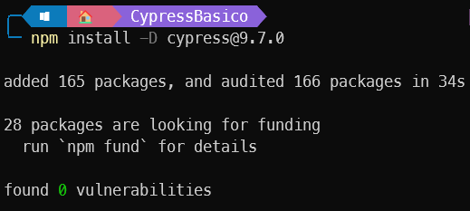
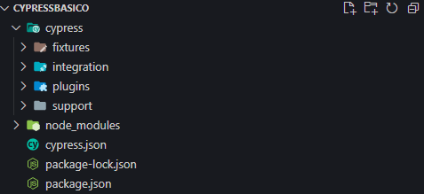
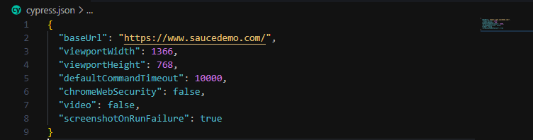
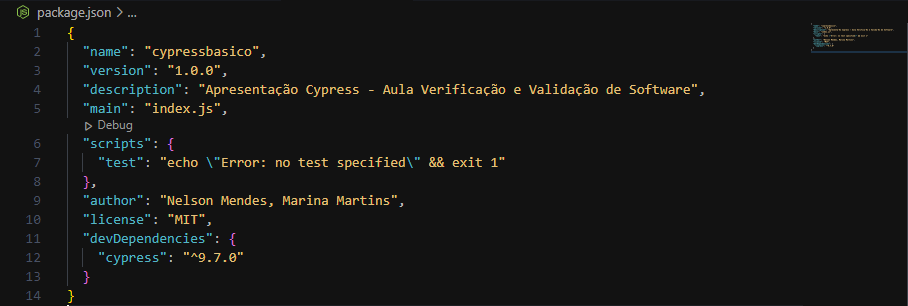

# Guia Basico - Cypress
    - Projeto básico de apresentação do framework de testes E2E - Cypress.
    - Materia: Verificação e Validação de Software
      - Professor: Rafael Leal
      - Alunos: Nelson Gomes Ferreira Mendes Neto / Marina de Souza Martins

### Requisitos do sistema
* macOS 10.9 e acima ( Intel ou Apple Silicon 64 bits ( x64 ou arm64 ) )
* Linux Ubuntu 12.04 e acima, Fedora 21 e Debian 8 (x86_64 or Arm 64-bits)
* Windows 7 e acima Apenas ( 64 bits )
* Node.js 12 ou 14 e acima

### Configuração
*  Instalar NodeJs(versão LTS 16 ou superior): https://nodejs.org/en/
* IDE Sugerida (Visual Studio Code): https://code.visualstudio.com/

## Iniciando Projeto

```bash
# Para configurar o arquivo package.json inserir o codigo no terminal:
npm init

 # Para configurar de forma automatica basta inserir o codigo no terminal:
npm init -y
```


```bash
# Para instalar a dependencia do Cypress basta informar o codigo no terminal:
npm install --save-dev cypress@9.7.0

# Para instalar a versão mais recente basta retirar o @9.7.0 mas a sugestão é utilizar
# a versão 9.7.0 por ser mais estavel.
```


```bash
# Apos concluir a instalação da dependencia do cypress no diretorio, inserir o codigo no terminal:
npx cypress run

# Será aberta a janela de execução de testes em modo visual, a mesma pode ser fechada.
```


```bash
# No terminal digitar o codigo abaixo para abrir o projeto no Visual Studio Code:
code .
```
### Estrutura do Projeto


* Cypress:  Armazena toda a estrutura de pastas do projeto
  * **Fixtures**: diretorio onde armazenamos arquivos json, imagens e pdfs que podem ser utulizados nos testes.
  * **Integration**: diretorio que armazenamos arquivos .spec.js(são os arquivos utilizados pelo Cypress para executar os testes)
  * **Plugins**: diretorio que armazena aquivos de configurações de plugins.
  * **Support**: diretorio que armazena arquivos ou pastas de suporte.
  * **Node Modules**: diretorio de configurações gerado pelo NodeJs(não alterar nada nesse diretorio ⛔)
  * **cypress.json**: arquivo de configurações do cypress como exemplo abaixo:
  
  * **package-lock.json**: arquivo que armazena todo o historio de instalação de dependencias do projeto.
  * **package.json**: arquivo de configuração do projeto criado nas configurações iniciais do projeto.
      