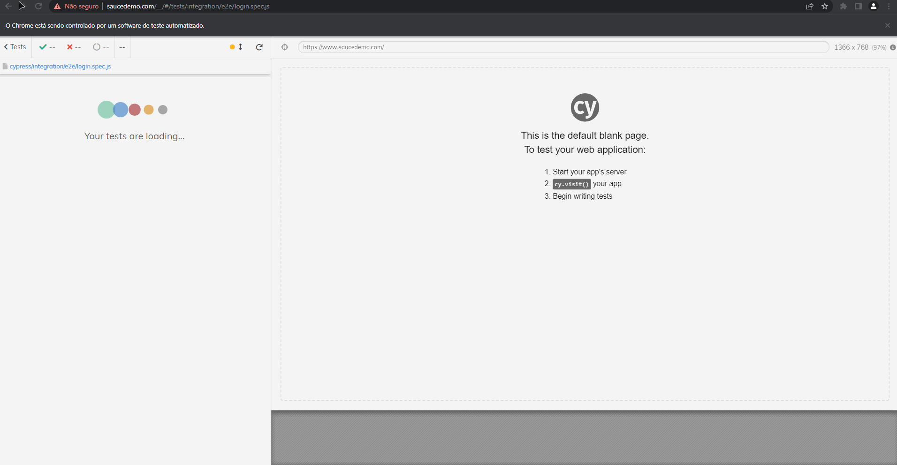

# Guia Basico - Cypress
    - Projeto básico de apresentação do framework de testes E2E - Cypress.
    - Materia: Verificação e Validação de Software
      - Professor: Rafael Leal
      - Alunos: Nelson Gomes Ferreira Mendes Neto 
                Marina de Souza Martins
                Douglas Silva Ferreira

### Requisitos do sistema
* macOS 10.9 e acima ( Intel ou Apple Silicon 64 bits ( x64 ou arm64 ) )
* Linux Ubuntu 12.04 e acima, Fedora 21 e Debian 8 (x86_64 ou Arm 64-bits)
* Windows 7 e acima Apenas ( 64 bits )
* Node.js 12 ou 14 e acima

### Configuração
* Instalar NodeJs(recomendo utilizar a ultima versão LTS): https://nodejs.org/en/
* IDE Sugerida (Visual Studio Code): https://code.visualstudio.com/
* Documentação oficial: https://docs.cypress.io/guides/overview/why-cypress

## Iniciando Projeto

```bash
# Para configurar o arquivo package.json inserir o codigo no terminal:
npm init

 # Para configurar de forma automatica basta inserir o codigo no terminal:
npm init -y
```


```bash
# Para instalar a dependencia do Cypress basta informar o codigo no terminal:
npm install --save-dev cypress@9.7.0

# ou
npm install -D cypress@9.7.0

# Para instalar a versão mais recente basta retirar o @9.7.0 mas a sugestão é utilizar
# a versão 9.7.0 por ser mais estavel.
```


```bash
# Apos concluir a instalação das dependencias do cypress no diretorio, inserir o codigo no terminal:
npx cypress run

# Será aberta a janela de execução de testes em modo visual, a mesma pode ser fechada.
```


```bash
# No terminal digitar o codigo abaixo para abrir o projeto no Visual Studio Code:
code .
```
### Estrutura do Projeto


* Cypress:  Armazena toda a estrutura de pastas do projeto
  * **Fixtures**: diretorio onde armazenamos arquivos json, imagens e pdfs que podem ser utilizados nos testes.
  * **Integration**: diretorio que armazenamos arquivos .spec.js(são os arquivos utilizados pelo Cypress para executar os testes)
  * **Plugins**: diretorio que armazena arquivos de configuração de plugins.
  * **Support**: diretorio que armazena arquivos ou pastas de suporte.
  * **Node Modules**: diretorio de configuração gerado pelo NodeJs(não alterar nada nesse diretorio ⛔)
  * **cypress.json**: arquivo de configurações do cypress como exemplo abaixo:
  
  * **package-lock.json**: arquivo que armazena todo o historico de instalação de dependencias do projeto.
  * **package.json**: arquivo de configuração do projeto criado nas configurações iniciais do projeto.
      

  ### Estrutura do arquivo Spec.js
  
* **reference types= cypress**: Ajuda o autocomplete a identificar as palavras chaves utilizadas pelo Cypress.
* **login.spec.js**: é o arquivo que o cypress utiliza para executar os testes na pagina alvo. A extensão .spec não é necessariamente obrigatoria mas é utilizada por boas praticas para identificar que é um arquivo de testes.
* **Describe**: Podemos informar qual funcionalidade será testada nessa spec:
    ```bash
    describe('Login', () => {

    })
    # Ou
    describe('Login', function(){

    })
    ```
* **Context**: Podemos informar o contexto do teste:
    ```bash
    context('Quando o usuario informar dados validos', function(){

    })
    # ou
    context('Quando o usuario informar dados validos', () => {

    })
    ```
* **It**: Incluimos todo o codigo do teste realizando as assertivas do contexto: 
  ```bash
    it('Deve realizar login com sucesso', () => {

    })
    # ou
    it('Deve realizar login com sucesso', function (){

    })
    # podemos utilizar .only para executar somente um teste especifico ignorando todos os outros testes da spec
    it.only('Deve realizar login com sucesso', () => {

    });
### Comandos Basicos
* **cy.visit()**: Esse comando é utilizado para abrir o navegador na pagina que iremos testar.
  ```bash
    cy.visit('http://www.google.com')
    # ou caso ja tenha uma baseUrl definida no arquivo cypress.json devemos apenas digitar o comando:
    cy.visit('/')
  ```

* **cy.get()**: é utilizado para pegar um elemento da tela(input, titulo, botão, etc)
  Exemplo:
  ```bash
  cy.get('#email');
  cy.get('.password')
  # caso seja necessario utilizar xpath, o comando deve ser (é necessario instalar a dependencia: npm install -D cypress-xpath):
  cy.xpath("//span[text()='Login']/..")
  ```
* **Type**: é utilizado para simular um usuario digitando em um input de texto por exemplo:
  ```bash
  cy.get('#password').type('pwd123');
  # podemos simular um enter no mesmo comando:
  cy.get('#password').type('pwd123{enter}')
  ```
* **Should**: é utilizado para realizar validações em elementos na tela, como por exemplo:
  ```bash
  # Quero verificar se um elemento está visivel na tela:
  cy.get('.title').should('be.visible')
  # Quero verificar se um elemento está visivel na tela e contem um determinado texto:
  cy.get('.title').should('be.visible').and('have.text', 'Bem Vindo!')
  ```

# Exemplo de estrutura de teste finalizada:
 

# Executando o teste
Para executar o teste em modo visual (abre navegador automanticamente e executa os testes) devemos digitar o seguinte comando no terminal:
```bash
npx cypress open
```
Devemos visualizar esta tela:
 

Para executar todos os testes basta clicar em "Run 4 integration specs" ou para executar um teste especifico basta clicar no teste desejado, por exemplio vamos executar o teste "login.spec.js" devemos visualizar a execução do teste:


Caso queira executar em modo headless, basta digitar o seguinte comando no terminal:
```bash
npx cypress run
# OBS: Todas as specs vão ser executadas.
```
Essa será a visualização da execução:
