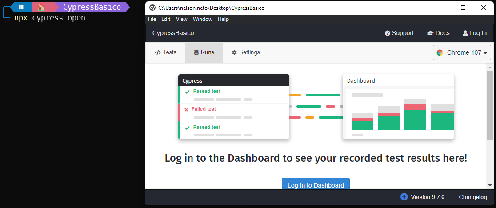

# Guia Basico - Cypress
    - Projeto básico de apresentação do framework de testes E2E - Cypress.
    - Materia: Verificação e Validação de Software
      - Professor: Rafael Leal
      - Alunos: Nelson Gomes Ferreira Mendes Neto 
                Marina de Souza Martins
                Douglas Silva Ferreira

### Requisitos do sistema
* macOS 10.9 e acima ( Intel ou Apple Silicon 64 bits ( x64 ou arm64 ) )
* Linux Ubuntu 12.04 e acima, Fedora 21 e Debian 8 (x86_64 ou Arm 64-bits)
* Windows 7 e acima Apenas ( 64 bits )
* Node.js 12 ou 14 e acima

### Configuração
*  Instalar NodeJs(recomendo utulizar a ultima versão LTS): https://nodejs.org/en/
* IDE Sugerida (Visual Studio Code): https://code.visualstudio.com/

## Iniciando Projeto

```bash
# Para configurar o arquivo package.json inserir o codigo no terminal:
npm init

 # Para configurar de forma automatica basta inserir o codigo no terminal:
npm init -y
```


```bash
# Para instalar a dependencia do Cypress basta informar o codigo no terminal:
npm install --save-dev cypress@9.7.0

# ou
npm install -D cypress@9.7.0

# Para instalar a versão mais recente basta retirar o @9.7.0 mas a sugestão é utilizar
# a versão 9.7.0 por ser mais estavel.
```


```bash
# Apos concluir a instalação da dependencia do cypress no diretorio, inserir o codigo no terminal:
npx cypress run

# Será aberta a janela de execução de testes em modo visual, a mesma pode ser fechada.
```


```bash
# No terminal digitar o codigo abaixo para abrir o projeto no Visual Studio Code:
code .
```
### Estrutura do Projeto


* Cypress:  Armazena toda a estrutura de pastas do projeto
  * **Fixtures**: diretorio onde armazenamos arquivos json, imagens e pdfs que podem ser utulizados nos testes.
  * **Integration**: diretorio que armazenamos arquivos .spec.js(são os arquivos utilizados pelo Cypress para executar os testes)
  * **Plugins**: diretorio que armazena aquivos de configurações de plugins.
  * **Support**: diretorio que armazena arquivos ou pastas de suporte.
  * **Node Modules**: diretorio de configurações gerado pelo NodeJs(não alterar nada nesse diretorio ⛔)
  * **cypress.json**: arquivo de configurações do cypress como exemplo abaixo:
  
  * **package-lock.json**: arquivo que armazena todo o historio de instalação de dependencias do projeto.
  * **package.json**: arquivo de configuração do projeto criado nas configurações iniciais do projeto.
      

  ### Estrutura do arquivo Spec.js
  
* **reference types= Cypress**: Ajuda o autocomplete a identificar as palavras chave utilizadas pelo Cypress.
* **login.spec.js**: é o arquivo que o cypress utiliza para executar os testes na pagia alvo. A extensão .spec não é necessariamente obrigatoria mas é utilizda por boas praticas para identificar que é um arquivo de testes.
* **Describe**: podemos informar qual funcionalidade será validada com o teste como por exemplo:
    ```bash
    describe('Login', () => {

    })
    # Ou
    describe('Login', function(){

    })
    ```
* **Context**: aqui podemos informa o contexto do teste que será executado como por exemplo:
    ```bash
    context('Quando o usuario informa dados validos', function(){

    })
    # ou
    context('Quando o usuario informa dados validos', () => {

    })
    ```
* **It**: aqui é onde fica a assertiva do teste e toda sua estrutura de execução: 
  ```bash
    it('Deve realizar login com sucesso', () => {

    })
    # ou
    it('Deve realizar login com sucesso', function (){

    })
    # podemos utilizar .only para executar somente um teste especifico ignorando todos os outros testes da spec
    it.only('Deve realizar login com sucesso', () => {

    });
### Comandos Basicos
* **cy.visit()**: Esse comando é utilizado para abrir a pagina web que iremos testar. Diferente do selenium que devemos instanciar um driver para depois inserir a url da pagina.
Exemplo: 
  ```bash
    WebDriver driver = new FirefoxDriver();
    driver.get("http://www.google.com");
  ```
  com Cypress informaremos somente o comando:
  ```bash
    cy.visit('http://www.google.com')
    # ou caso ja tenha uma baseUrl definida no arquivo cypress.json devemos apenas digitar o comando:
    cy.visit('/')
  ```

* **cy.get()**: diferente do selenium que precisamos informar qual seletor estamos utilizando.
Exemplo:
  ```bash
    Driver.FindElement(By.Id("#email"));
    Driver.FindElement(By.XPath("//span[text()='Login']/.."));
  ```
  com Cypress podemos passar de forma direta que o mesmo já reconhece o tipo de seletor utilizado. 
  Exemplo:
  ```bash
  cy.get('#email');
  cy.get('.password')
  # apenas quando ulizamos XPath que devemos informar o tipo de seletor(é necessario instalar a dependencia: npm install -D cypress-xpath)
  cy.xpath('//span[text()="Login"]/..')
  ```
* **Type**: é utilizado para simular um usuario digitando em um input de texto, diferente do selenium que devemos utilizar "SendKeys".
  Exemplo:
  ```bash
    Driver.FindElement(By.Id("#email")).SendKeys("seuEmail@dominio.com");
  ```
  com Cypress o comando é mais simples de utilizar.
  Exemplo:
  ```bash
  cy.get('#password').type('pwd123');
  # podemos simular um enter no mesmo comando:
   cy.get('#password').type('pwd123{enter}')
  ```